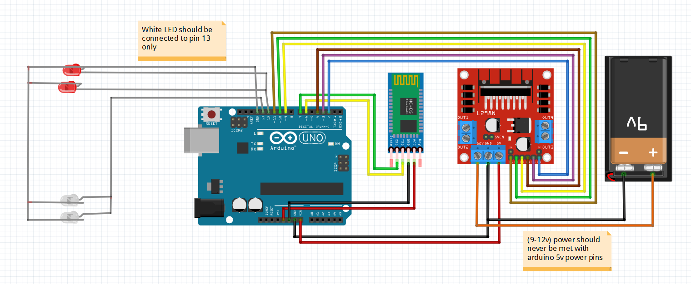
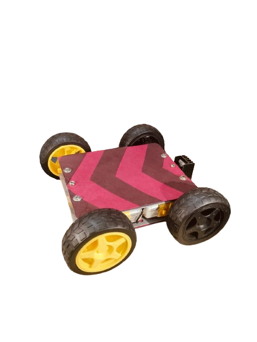
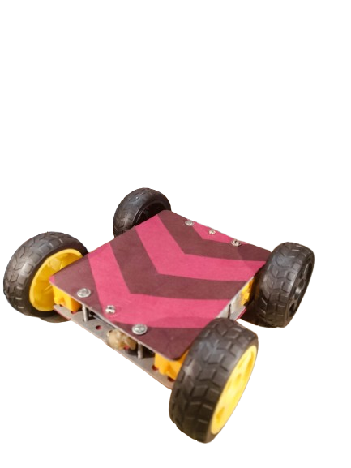

# BluetoothCAR
# 🚗 Bluetooth Controlled Arduino Car Project

This is a DIY Bluetooth-controlled car built using an **Arduino Uno**, **HC-05 Bluetooth module**, and **L298N motor driver module**. The car is wirelessly controlled via a smartphone Android app and is perfect for beginners in robotics and embedded systems.

---

## 🔧 Features

- Wireless Bluetooth control using HC-05
- Motor control via L298N H-Bridge
- Forward, backward, left, right, stop, lights commands
- Compatible with Android/Iphone smartphone apps
- Modular and expandable for future upgrades

---

## 📦 Components Used

| Component               | Quantity |
|------------------------|----------|
| Arduino Uno R3         | 1        |
| HC-05 Bluetooth Module | 1        |
| L298N Motor Driver     | 1        |
| DC Gear Motors         | 4        |
| Car Chassis (4WD)      | 1        |
| Wheels                 | 4        |
| Battery (12V)          | 1        |
| Jumper Wires           | -        |
| Smartphone             | 1        |

---

## 🔌 Wiring Diagram

---

## 💻 Arduino Code

The Arduino sketch is located in the `car_code/` folder:
- File: `code.txt`
- File: `code.ino`
  
It records characters sent via Bluetooth and drives the motors accordingly.

**Sample Commands:**
- `W` → Forward
- `S` → Backward
- `A` → Left
- `D` → Right
- `X` → Stop
- `F` → Front Led On
- `f` → Front Led Off
- `B` → Back Led On
- `b` → Back Led Off
---

## 📱 Android App Control

[note incomplete]

## 🚀 How to Run

1. Upload `code.ino` to the Arduino Uno using the Arduino IDE.
2. Power the car with a battery pack (avoid USB during motor operation).
3. Pair HC-05 with your phone (`Default password: 1234` or `0000`).
4. Open your Bluetooth controller app and connect.
---

## 📸 Demo Images

---

## 🛠️ Future Improvements (Optional)

You can upgrade this car with:
- Ultrasonic sensor for obstacle avoidance
- Line-following IR sensors
- Voice control via Android app
- IoT control using WiFi (ESP8266)
- Camera module for FPV
- GPS module for navigation

---

## 👨‍💻 Author & Credits

- **Aditya Sharma ** – [GitHub Profile](https://github.com/aditya14sharma01)
- Feel free to fork or modify this project!

